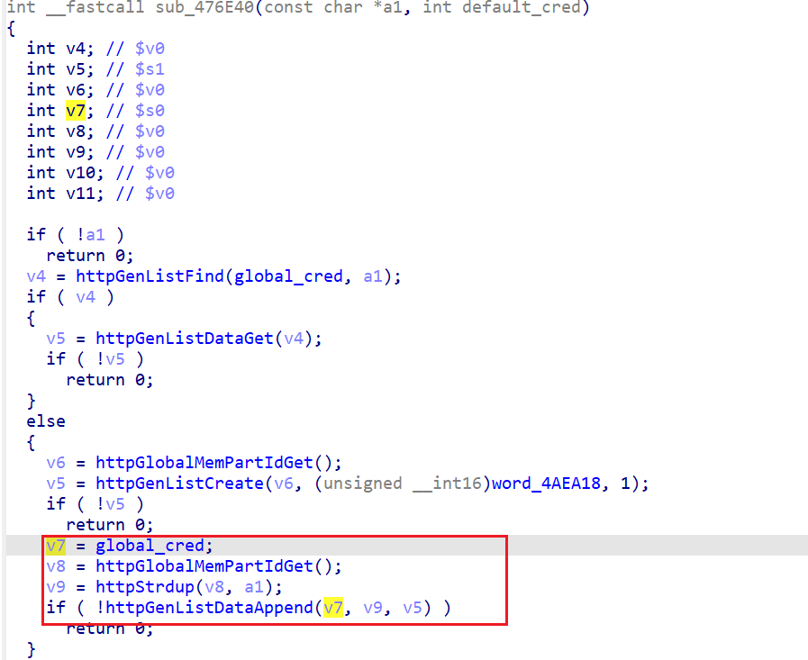

# TL-WA850RE V2 hard coded credential

## firmware imformation

Vendor: TP-Link

Product: TL-WA850RE V2

Affected Version: 

- TL-WA850RE(EU)_V2_171228
- TL-WA850RE(EU)_V2_171123
- TL-WA850RE(EU)_V2_160527

## Description

TL-WA850RE V2 contains a hard-coded credential vulnerability in the binary `/usr/bin/httpd`. Unauthenticated attackers can reverse engineer the product and gain the proper admin credentials, which can then make them privileged users.

## Detail

During initialization, /usr/bin/httpd added some credential into local storage. These credential are hard-coded. Attackers can gain these credential by reversing the firmware.

In function `httpPwdConfAdd`, the provided credential is stored via `sub_476E40`

In `sub_476E40`, the provided credential will be stored into `global_cred`.

During authentication process, the firmware uses `Basic authentication` , comparing user provided credential with the one stored in `global_cred`. 

So attackers can send the credential `admin:admin` and `allowed:allowed` to become privileged. 

## payload

Attackers can add the following header into http packet to become privileged.

> Authorization: Basic: YWRtaW46YWRtaW4=
>
> Authorization: Basic: YWxsb3dlZDphbGxvd2Vk

## Timeline

[25/02/07] report to CVE
