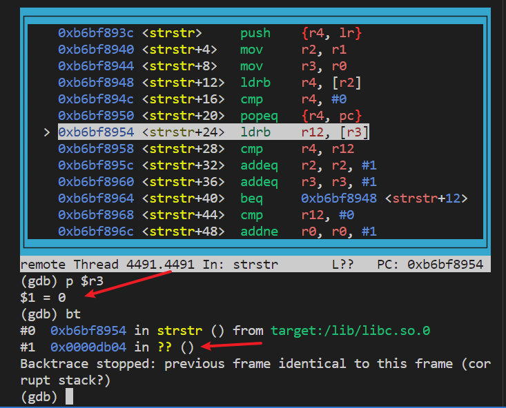

# ASUS ac68U NULL pointer dereference

ASUS [4G-AC68U](https://www.asus.com.cn/supportonly/4g-ac68u/helpdesk_bios?model2Name=4G-AC68U), firmware version [3.0.0.4.384.82230](https://dlsvr04.asus.com.cn/pub/ASUS/wireless/4G-AC68U/FW_4G_AC68U_300438482230.zip?model=4G-AC68U) .The binary `/usr/sbin/httpd` has NULL pointer dereference vulnerability. Remote attackers can send malicious packet to the router, which will cause DoS(Deny of service) attack.

## POC

In file [POC](./poc)

## Crash analysis

After sending the malicious packet, the router will crash, in function `strstr`. The below code shows that register r3 is zero. which indicates NULL-Pointer-Dereference 

The backtrace indecates that function in `0xdb04` causes this vulnerability. The `v6+2` is NULL before putting into strstr() function.

