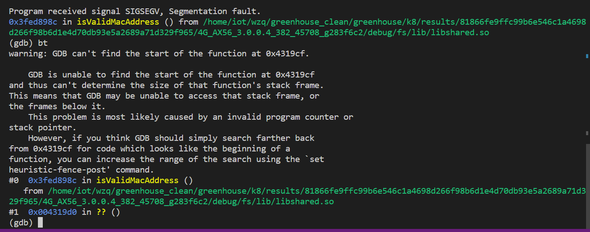

# 4G_ax56 internet_ctrl.cgi DoS attack

In asus 4G-ax56 version  [3.0.0.4.382_45708](https://dlcdnets.asus.com/pub/ASUS/wireless/4G-AX56/FW_4G_AX56_300438245708.zip?model=4G-AX56) , the binary `/usr/sbin/httpd` has a NULL pointer dereference bug.Remote attackers can send malicious packet to the router, which will cause DoS(Deny of service) attack.

## PoC

see [poc](./poc)

## attacking

