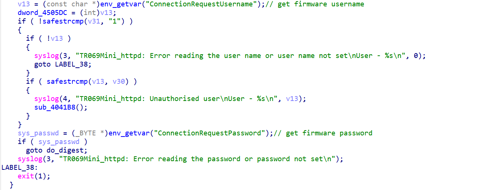
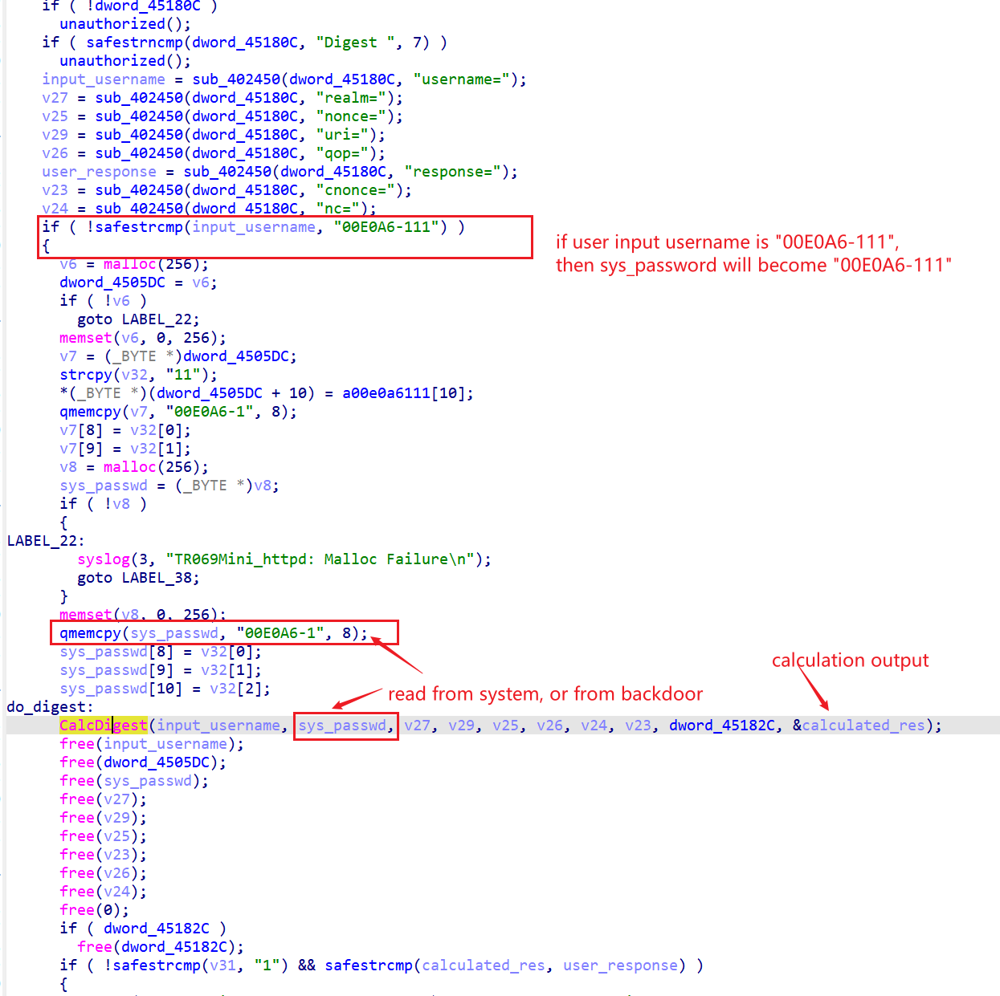
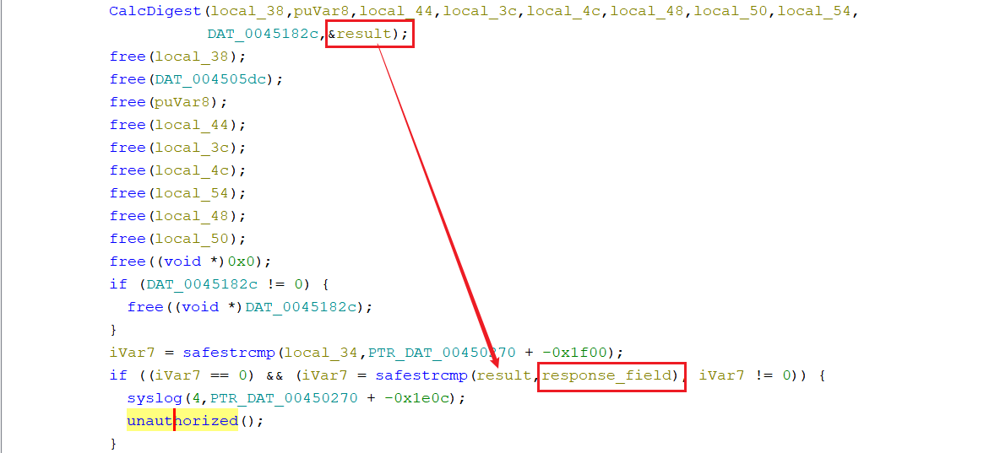

# belkin F9K1010_WW_2.00.04 hardcoded credential

## product

vendor: belkin

product: F9K1010

version: up to F9K1010_WW_2.00.04

support url: https://www.belkin.com/support-article/?articleNum=156290

## Description

In belkin F9K1010_WW_2.00.04, hard-coded credential on the Web Interface allows anyone to log in to the firmware directly to perform administrative functions. Malicious attacker can reverse the firmware and use hard-coded credential with username '00E0A6-111' and password '00E0A6-111' for authentication.

## details

In function `0x4042E0` of the web service of the firmware, which is `mini_httpd`, the following code handles authentication. The following code reads credential stored inside firmware

The read credential is then send into function `CalcDigest` to do digest calculation. Note that in the following code, if user's username is "00E0A6-111", then sys_passwd will be automatically replaced with static value "00E0A6-111"

The login procedure takes `calculated_res` from CalcDigest's result, and compares it against with user;s input in the `response` field

Attackers can effectively guess the calculation output from the hard-coded username and password and use the hard-coded credential to log into the firmware.

Note that CalcDigest (in libssap.so) uses md5 to hash user inputs. Since all inputs are known under this scenario, attackers can easily guess the right digest result.

The vulnerability is contacted to the vendor first, but the vendor did not reply within 30 days.