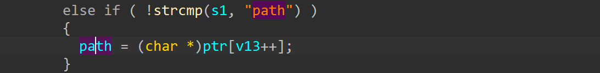

# dlink scandir.sgi buffer overflow 

This vulnerbility lies in `sub_1C130` function in cgibin , which influences dlink router [DIR868LB1](https://files.dlink.com.au/products/DIR-868L/)

## vulnerbility description

There is a stack based overflow in function `sub_1C130` function in cgibin. the binary cgibin is called by http server `httpd` to handle user requests. Malicious user can provide a very long request uri which contains the `path` argument . This argument is extracted by the code below, at address`0x1D16C` in cgibin binary

Then this argument is passed to scandir process function (sub_1C130) without any check, and strcat() copies this argument into a stack-based variable, which may cause stack overflow(at address `0x1C7B0`)

## timeline

[2024/1/22] report to CVE