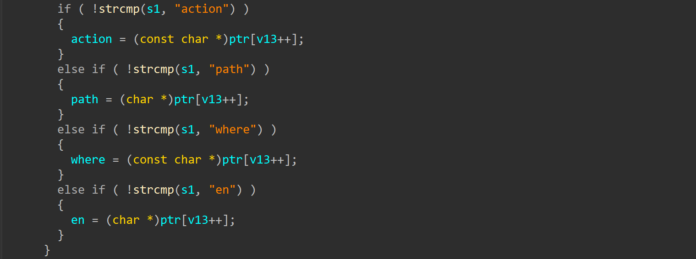
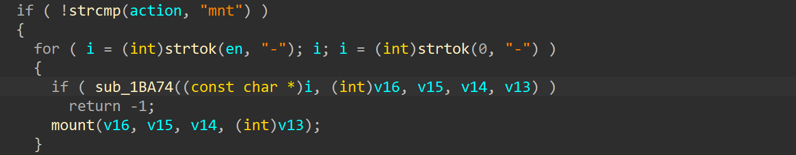
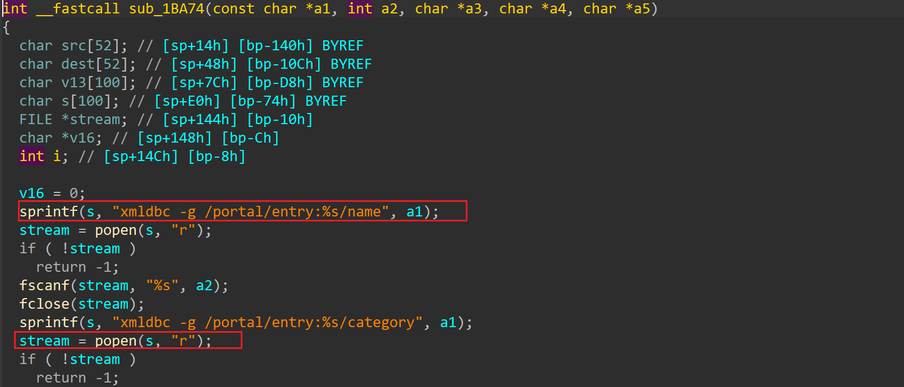

# dlink scandir.sgi "en" buffer overflow and command injection

This vulnerbility lies in `sub_1BA74` function in cgibin , which influences dlink router [DIR868LB1](https://files.dlink.com.au/products/DIR-868L/)

## vulnerbility description

There is a stack-based buffer overflow in `sub_1BA74` function in cgibin. The binary cgibin is called by http server `httpd` to handle user requests. Malicious users can provide a URL request with argument action="mnt" and en="-xxx". to trigger this vulnerbility

Then the "en" argument will be passed into function `sub_1C130` without any check, and will be splited by "-", then passed into `sub_1BA74`. 

Then this argument will be copied to a stack-based variable 's', which will cause stack overflow. Then it will be passed into popen(), which will cause command injection

## timeline

[2024/1/22] report to CVE