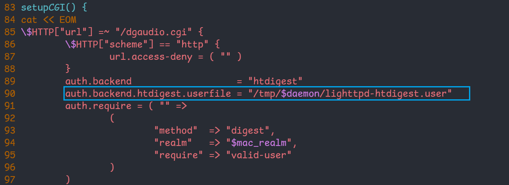
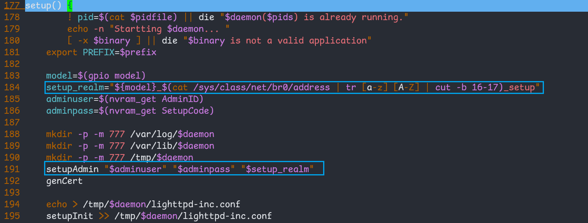
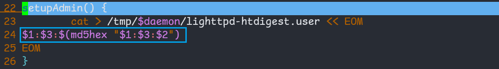

# D-link DSH-C310FW predictable password

## firmware information

Vendor: D-link

Firmware: D-link DSH-C310FW

Version: DSH-C310FW1.05

Firmware support URL: https://www.dlink.ru/mn/products/1433/2206.html

## Description

D-link DSH-C310FW is found to have predictable password. Unauthenticated attackers can send malicious packet containing predictable credential and gain administrative privilege. 

## Detail

During firmware initialization, `sbin/lighttpd.sh` will be executed to initialize web server's running environment. The firmware uses `lighttpd` as webserver backend and uses configuration file `lighttpd-htdigest.user` as authenticated file. 

The following function `setup` contains the initialization of firmware's password. It uses `setup_realm` as the third argument and transfer it to function `setupAdmin`. Notice that `setup_realm` is predictable since it uses the firmware's model name, MAC address and constant string "_setup" as input, which can be effectively guessed or acquired by attackers. (For example, attackers can get the MAC address of the firmware through web packet sniffing)

In function `setupAdmin`, it uses the third argument (which is the predictable `setup_realm`) as password( according to the specification of lighttpd authentication mod manual: https://redmine.lighttpd.net/projects/lighttpd/wiki/mod_auth). So the firmware acutally uses predictable password for authentication. 

## Timeline
[05/04/2025] assigned CVE-2025-27994

