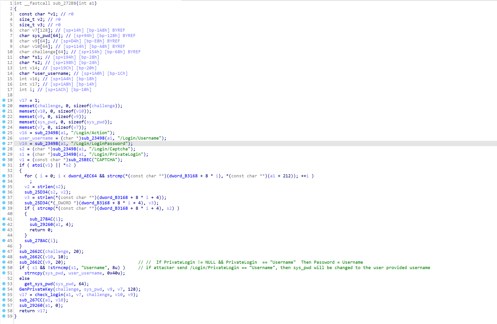

# DSL5300 authentication backdoor

## firmware information

Vendor: D-link

firmware: DSL5300

Affected Version

- DSL-5300_AU_v1.00 

- DSL-5300_AU_v1.05

- DSL-5300_AU_v1.07

Manual website: https://files.dlink.com.au/products/DSL-5300/Manuals/DSL-5300_A1_Manual_v1.11(WW).pdf

## Description

D-link DSL5300 contains backdoor during firmware authentication. Unauthenticated attacker can send malicious packet containing `/Login/PrivateLogin` to bypass authentication procedure.

## Detail

In binary `/bin/cgi-prog`, the following code handles authentication prodecure(at address 0x272B8)

Notice that at line 50, If /Login/PrivateLogin!= NULL && /Login/PrivateLogin  == "Username"  Then Password = Username. Which makes the result of `GenPrivateKey` predictive. Malicious attackers can send packet containing /Login/PrivateLogin="Username" and predict password generated by the firmware to gain administrative privilege. 

This vulnerability is a recurring vulnerability of `CVE-2020-8863`, but was first found on this product. 

## Timeline

[02/12/2025] report to cve