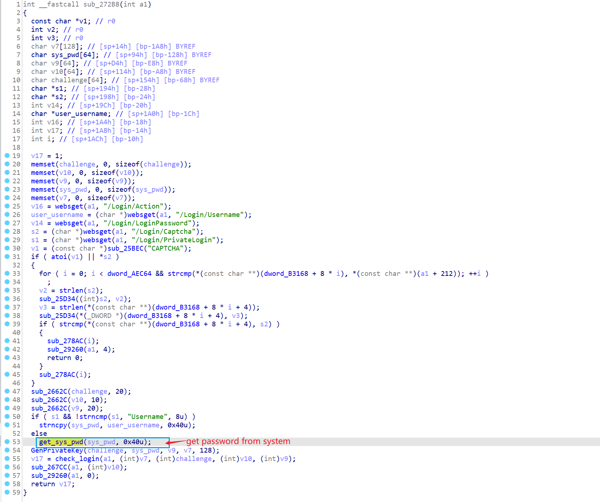
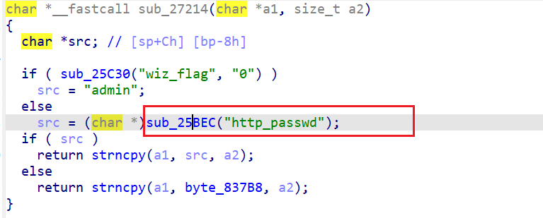
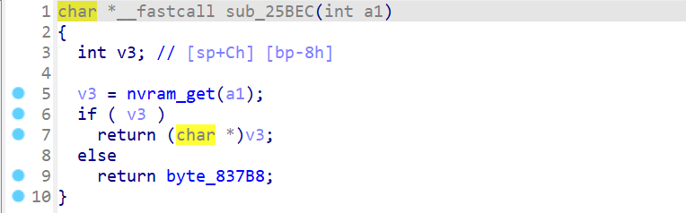
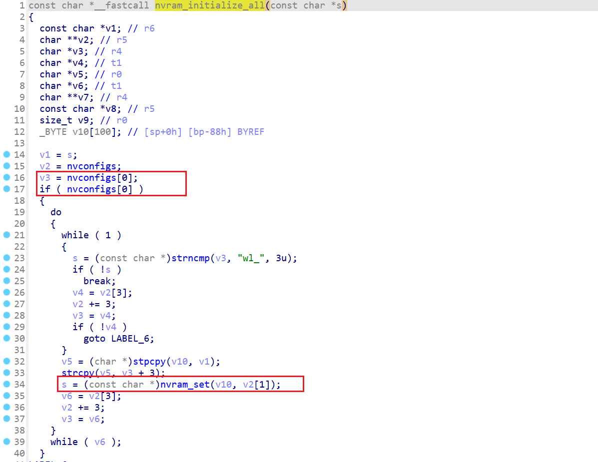
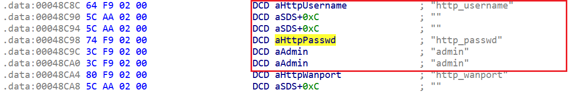

# DSL5300 uses default password for authentication

## firmware information

Vendor: D-link

firmware: DSL5300

Affected Version

- DSL-5300_AU_v1.00 

- DSL-5300_AU_v1.05

- DSL-5300_AU_v1.07

Manual website: https://files.dlink.com.au/products/DSL-5300/Manuals/DSL-5300_A1_Manual_v1.11(WW).pdf

## Description

Dlink DSL5300 is found to use default password for authentication. Malicious attackers can send authentication packet containing default password for authentication and gain administrative privilege.

## Detail

In dlink DSL5300, the following code handles authentication procedure. 

In function `get_sys_pwd`, the firmware reads content in `nvram` using key `http_passwd`. 

Below is the implementation of  function `sub_25bec`

However, during initialization, the firmware load default content into `http_passwd` through `nvram_initialize_all` in binary `libshared.so`. the following code read contents from global variable(with name `nvconfigs` at address `0x46B80`, each with 3*4 bytes step length) and set default content for (at offset 4) for nvram key(at offset 0)

We can find the default value for `http_passwd` and `http_username` at address 0x48C88

So, malicious attackers can send the following credential to gain administrative privilege.

> username: ""
>
> password: "admin"

## Timeline

[02/12/2025] report to cve