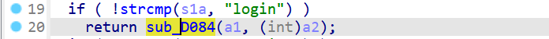
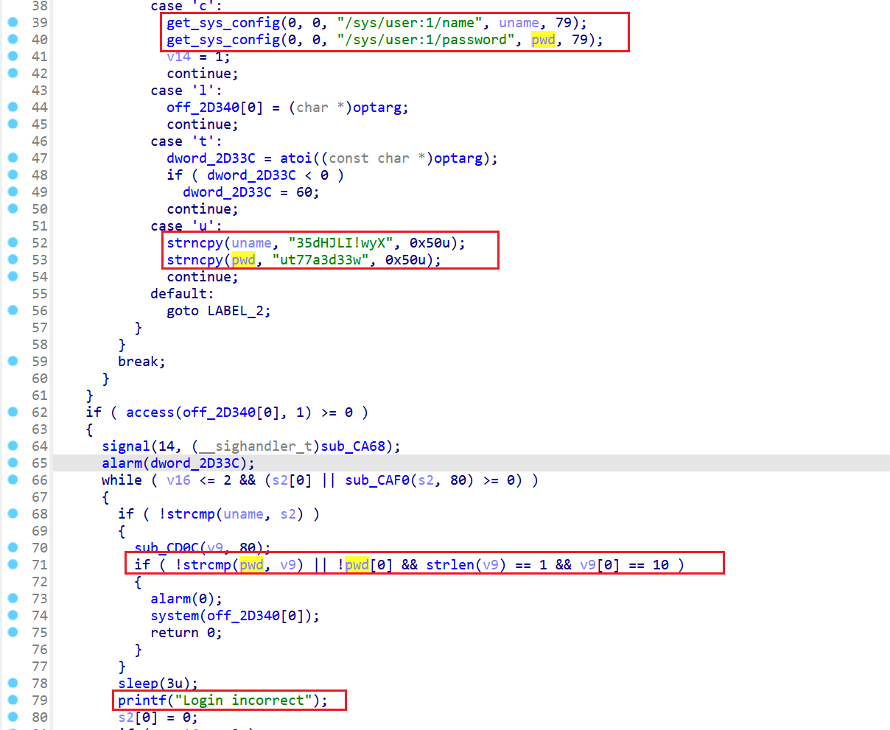

# D-Link dir890L hardcoded login shell

## Description

In D-Link dir890L devices, there contains a hard-coded credential for UART authentication. Users can log in into the device's UART port via the hard-coded credential and gain root privilege.

Affected devices: D-Link dir890L, Official URL: https://www.dlink.com/uk/en/products/dir-890l-ac3200-ultra-wifi-router

Affected Versions: Versions up to  DIR890LA1_FW111b04.

Firmware download URL: https://files.dlink.com.au/products/DIR-890L/REV_A/Firmware/Firmware_v1.20b01/DIR890LA1_FW111b04.bin

## Details

In the `rgbin` binary of D-Link dir890L, the authentication for UART is handled via function at address 0xD084.  It compares user's input with credential retrieved from system configuration, the system will uses the hardcoded credential `35dHJLI!wyX:ut77a3d33w` for authentication with the configuration in case UART is 

The security impact would be a attacker having physical access to the device and uses UART to login into the device and gain root privilege.