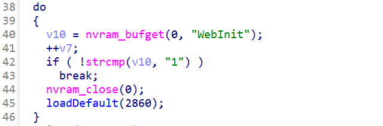

# D-Link several default credential vulnerabilities

There are several products using default credential for management

## default credential in etc/passwd or etc/shadow

### Affected products

1. DXS-1100-16SC_fw_revA_1-00-B030_20200604
2. DWS-3160-24TC_fw_revA2_4-4-1-10_complete_package_20161116
3. DAP-2020_fw_reva_102rc002_ALL_en_20200322
4. DWC-2000_fw_revALL_4-7-5-1B101_complete_package_20210503
5. DAP-1360_fw_revf_615eub01_EU_en_20230114

For the above products, the etc/shadow file uses the following content. Note that /etc/shadow is used for authentication for ssh services or other services

### Example

Take  `DWS-3160-24TC_fw_revA2_4-4-1-10_complete_package_20161116` as an example。 The etc/shadow file is shown following. There contains two default accounts, which are `root` and `Admin` with hashed values.

```txt
root:$1$$zdlNHiCDxYDfeF4MZL.H3/:10933:0:99999:7:::
Admin:iCDxYDfeF4MZL.H3/:10933:0:99999:7:::
bin::10933:0:99999:7:::
daemon::10933:0:99999:7:::
adm::10933:0:99999:7:::
lp:*:10933:0:99999:7:::
sync:*:10933:0:99999:7:::
shutdown:*:10933:0:99999:7:::
halt:*:10933:0:99999:7:::
uucp:*:10933:0:99999:7:::
operator:*:10933:0:99999:7:::
nobody::10933:0:99999:7:::
ap71::10933:0:99999:7:::
```

And the pppd services in this firmware uses etc/shadow for authentication.


These vulnerabilities will cause unauthorized access to this device. Since we cannot decrypt these credentials, we cannot give a POC.

The rest products contains the same vulnerability

## default credentials in customized files

The following products uses default credentials in customized files. These files will be loaded as default value when firmware boot.

### Affected devices

1. DCS-6517_REVB_FIRMWARE_v2.00.03

2. DCS-934L_REVA_FIRMWARE_1.05.04

3. DCS-932L_REVB_FIRMWARE_v2.16.08

3. DCS-930L_REVA_FIRMWARE_1.16.04

The above devices contains default credentials in customized file like `RT2860_default_vlan`.

### Example

Take `DCS-930L_REVA_FIRMWARE_1.16.04` as an example. The `nvram_daemon` binary uses the below function to load default value whensystem boots.




The default file RT2860_default_vlan contains the web management credential in plain-text, which corresponds to `admin:<empty>`


The rest products contains the same vulnerability. These vulnerabilities will cause unauthorized access to this device.


## Security Compliance

According to the **NIST SP 800-63B** Digital Identity Guidelines, default or static passwords (even if hashed) are not allowed for initial user authentication.

https://pages.nist.gov/800-63-3/sp800-63b.html

> Memorized secrets that are randomly chosen by the CSP (e.g., at enrollment) or by the verifier (e.g., when a user requests a new PIN) SHALL be at least 6 characters in length and SHALL be generated using an approved random bit generator [SP 800-90Ar1].

