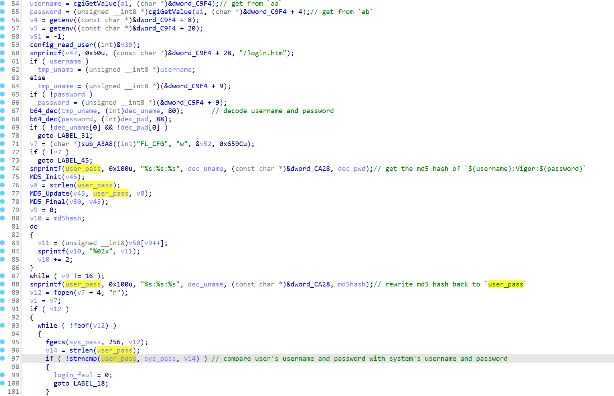

# Draytek Vigor1000 firmware hardcode credential

## firmware information

Vendor: draytek

firmware: Vigor1000

Affected version:v1.5.4.2

firmware download url: https://fw.draytek.com.tw/Vigor1000/Firmware/v1.5.4.2/Vigor1000_v1.5.4.2.zip

## Description

Draytek Vigor1000 has hard coded credential for web interface. It allows anyone to log in to the firmware directly to perform administrative functions. The affected binary is `/usr/sbin/lighttpd`

## Detail

In the login page of firmware, The following code handles user's authentication data, transferring user provided credential to backend `/cgi-bin/webstax/login/login`

In the binary `login`, the followingf code handles user's request and do the authentication. We can see the main procedure is to md5 hash concated user privided credential(line 74 is the concat procedure, line 75-78 is MD5 procedure), then put the md5 result back to authentication input(Line 88) and conpare it against system's password. (Line 97)

However, The system's password is hardcoded in file `/etc/httpusers.conf` (This is indicated by lighttpd configuration file)

In the `/etc/httpusers.conf`, we can see the following lines

However, The md5 is vulnerabile to brute-force attack. The following input is a valid credential which meets the requirement of md5 hash.(See the below picture, which has the same md5 has value with the second line in `/etc/httpusers.conf`)

> username: admin
>
> password: admin

So, malicious attackers can send malicious packet containing username=admin and password=admin to gain administrative privilege.

## Timeline
[05/04/25] assigned CVE-2025-27988