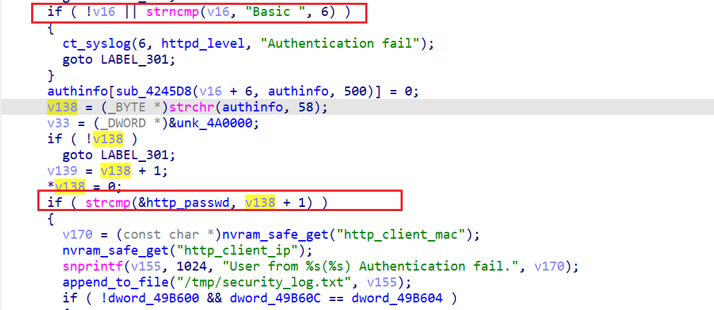
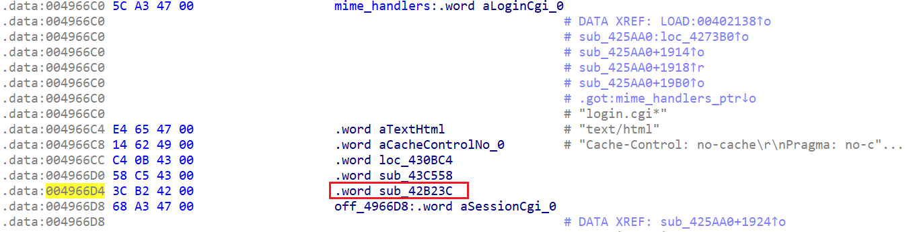
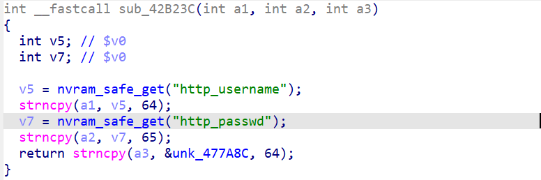
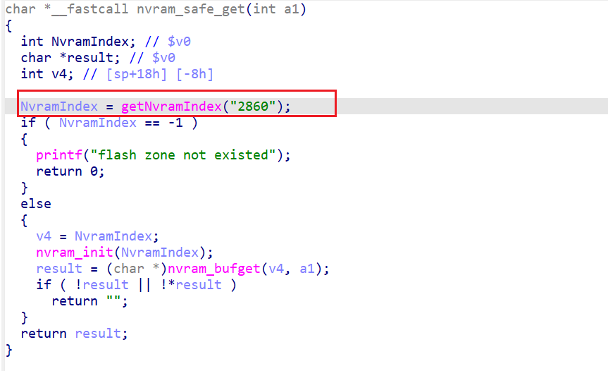
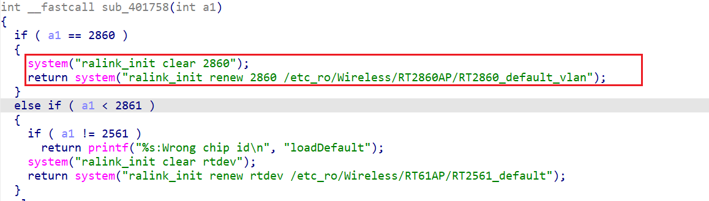
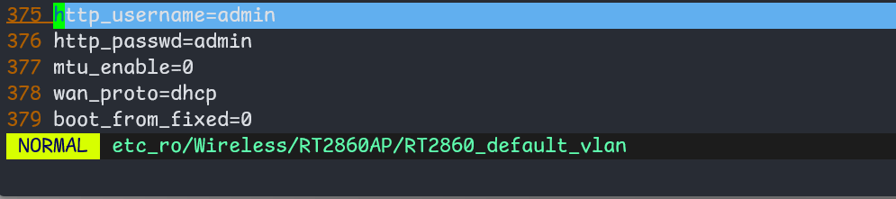

# Linksys E5400 weak default password

## firmware information

Vendor: Linksys

Product: E5400 ([website](https://support.linksys.com/kb/article/3730-en/))

Version: 1.0.00.037

## Description

In Linksys E5400, Default credentials on the Web Interface allows anyone to log in to the firmware directly to perform administrative functions. 

## Detail

In the web service of Linksys E5400 (binary `/bin/httpd`). The following code handles user's authentication. The firmware uses basic authentication to check user's credential, and compare it against the global variable at address 0x49B688 (the variable `http_passwd`)

The global variable `http_passwd` is written through function `0x42b23c` in `mime_handlers`

In `nvram_safe_get`, the initialization process read default nvram settings through `getNvramIndex("2860")`

Upon looking for the file corresponding to "2860", the following code in `/bin/nvram_daemon` contains loading logic correspoding the initialization and renew of nvram. 

Opening the file T2860_default_vlan, it contains the default content for nvram key `http_passwd`

So attackers can use the following Line in header to log in into the firmware (admin:admin)

> Authorization: Basic: YWRtaW46YWRtaW4=