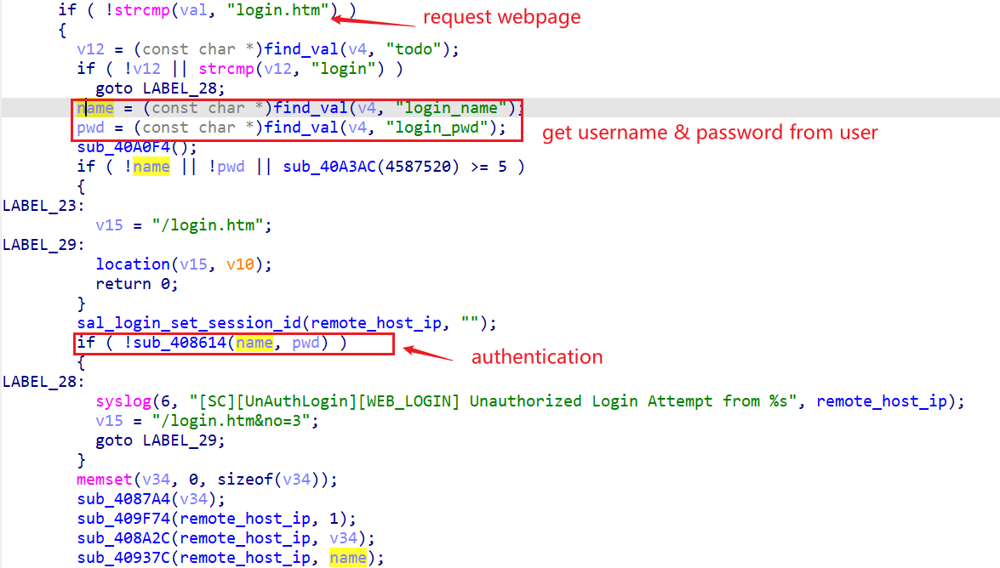
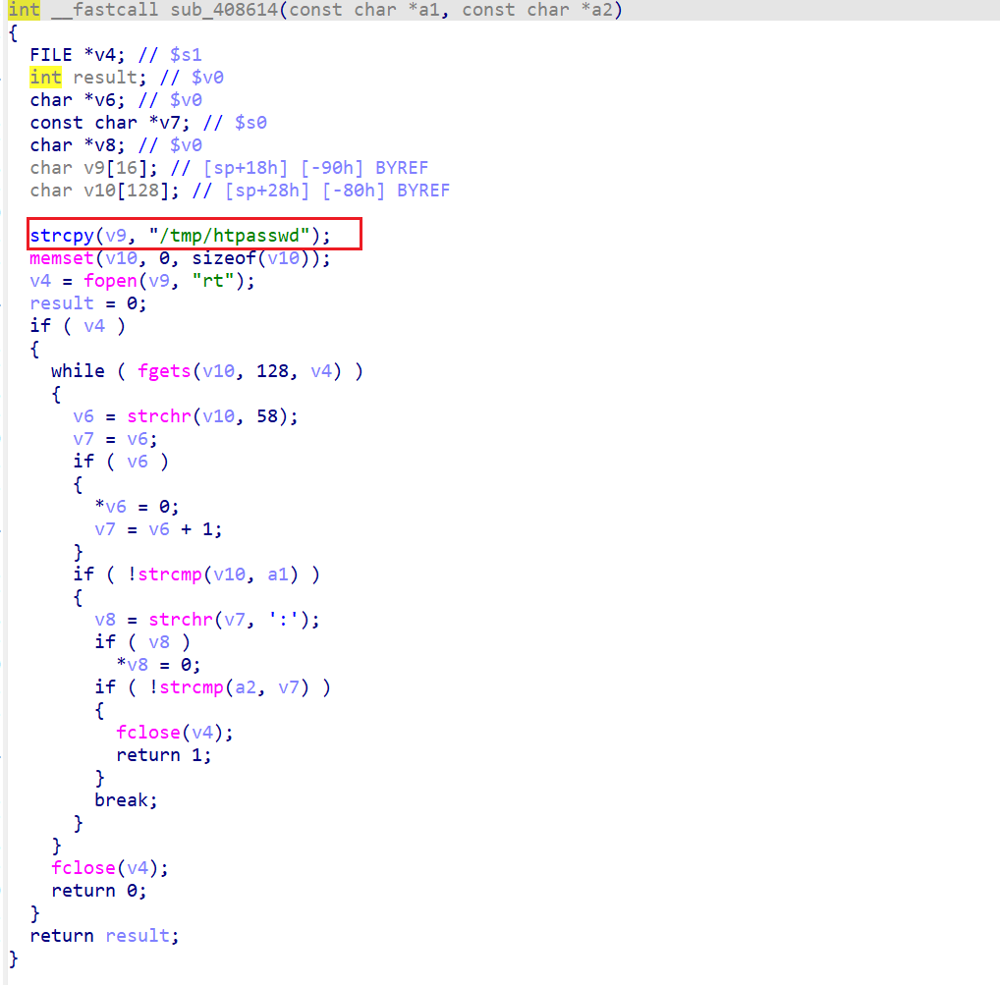
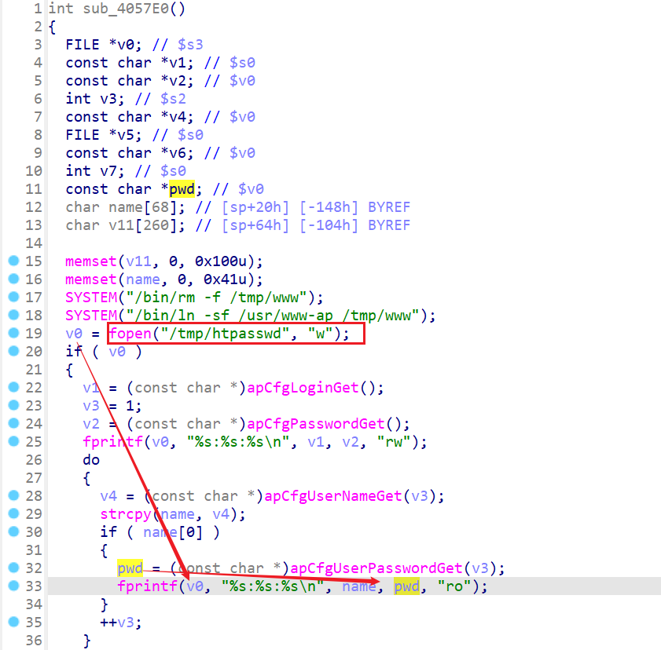
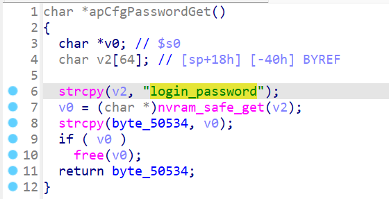
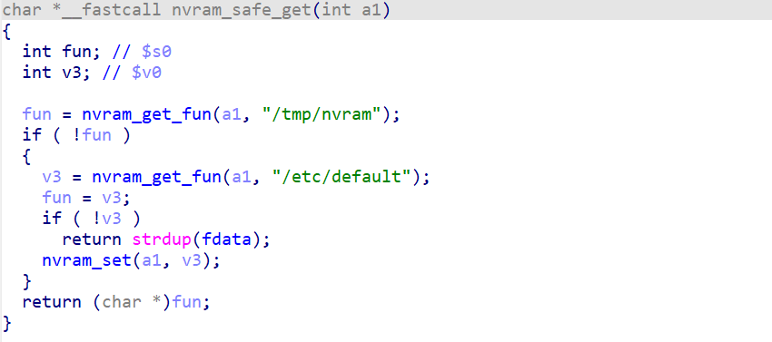
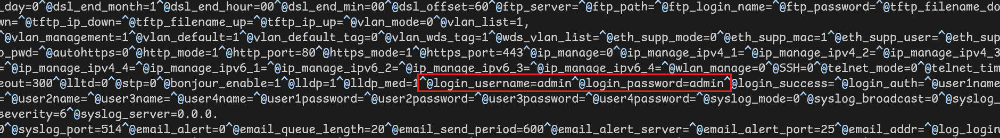

# FW_LAPAC1200_LAPAC1750_1.1.03.000 weak password

## firmware information

vendor: linksys

product: FW_LAPAC1200_LAPAC1750 ([manual](https://downloads.linksys.com/downloads/userguide/MAN_LAPAC1200_LNKPG-00114_RevB00_User_Guide_EN.pdf]))

Affected version: 1.1.03.000

## Description

In Linksys FW_LAPAC1200_LAPAC1750, Default credentials on the Web Interface allows anyone to log in to the firmware directly to perform administrative functions. Upon installation or upon first login, the application does not ask the user to change the password. There is no warning or prompt to ask the user to change the default password.

## Detail

In the web service of FW_LAPAC1200_LAPAC1750, which is binary `mini_httpd`. The following code handles user's login procedure. Function `sub_408614` contains authentication procedure.

The authentication function `sub_408614` read credential information from local file and compares it with user privided credential. 

Upon further searching `/tmp/htpasswd`, we found during firmware initialization process, '/sbin/rc' writes initiialization data into file "/tmp/htpasswd"

Further checking function `apCfgUserPasswordGet` in `lib/libapcfg.so`, the firmware read `login_password` from nvram and return the value.

During the initialization of nvram (in binary `lib/libnvram.so`), the following code read value from `/etc/default` to initialize nvram.

Take a look at /etc/default, The default nvram value for `login_password`  is `admin`. So attackers can use the following Line in header to log in into the firmware(admin:admin)

> Authorization: Basic: YWRtaW46YWRtaW4=

