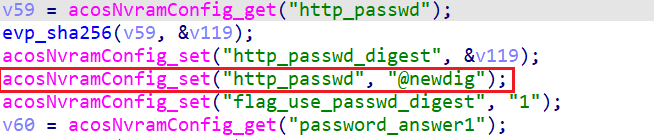
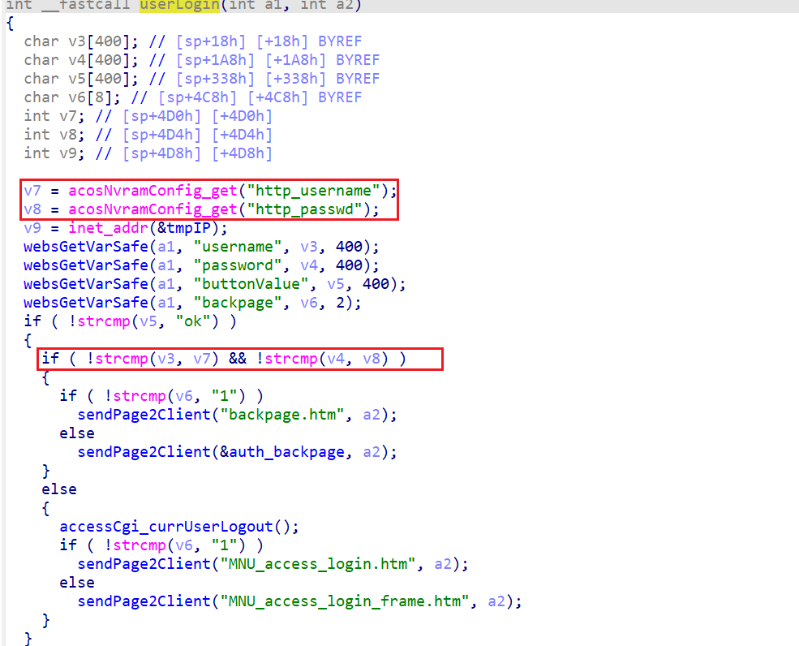

# netgear ex3700 hard-coded credential vulnerability

## firmware information

Vendor: Netgear

Product: EX3700

firmware version: 1.0.0.98

download URL: https://www.netgear.com/support/product/ex3700/#download

## description

In netgear ex3700 version 1.0.0.98, there contains a hard-coded password in the web service of product. The problems lines in binary `acos_service` . During initialization, `acos_service` generates hard-coded password into nvram. Attackers can send malicious packet containing the hard-coded credential to escalate privilege.

## Detail

During initialization procedure, `acos_service` will be invoked. The following code will be executed to set nvram with keyword "http_passwd". (address: 0x404850)

In binary `/usr/sbin/httpd`, the following code contains user authentication logic. It retrives user provided information from web packet and compares it with value from nvram with keyword "http_passwd". So attackers can send malicious pakcket containing password "@newdig" to ecsalate priviege.

## timeline

[25/02/09] report to CVE
