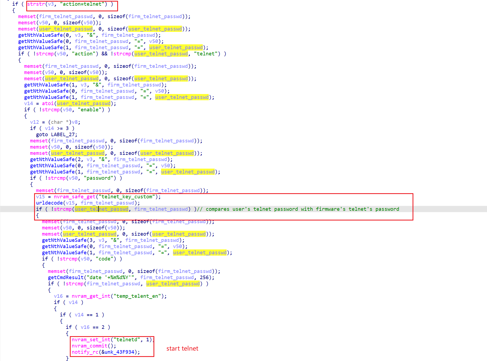
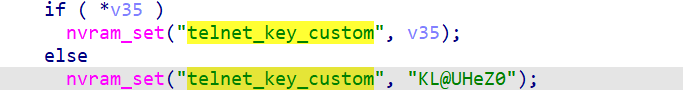

# totolink nr1800x hard-coded telnet password

## Affected firmware info

Vendor: Totolink

Affected Firmware

Nr1800x

- nr1800x-v9.1.0u.6681_b20230703

T6 V3

- V4.1.5cu.748_B20211015

x5000r

- v9.1.0cu.2350_b20230313

A720R

- V4.1.5cu.470_B20200911

x2000r

- v1.0.0-b20230726.1108

lr350

- v9.3.5u.6698_b20230810.rar

Download website: https://www.totolink.net/home/news/me_name/id/39/menu_listtpl/DownloadC.html

## Description

totolink Nr1800x, T6 V3, x5000r, A720R, x2000r, lr350 contains hard-coded telnet password, which allows any user to log into the telnet service of the device with root privilege.

## Detail

I will take firmware Nr1800x nr1800x-v9.1.0u.6681_b20230703 as an example.

In binary `www/cgi-bin/cstecgi.cgi`, The following code controls the telnet service. The following code is at address `0x437D40`.

Form the code above, we can find that the password used for telnet service is from `nvram_safe_get("telnet_key_custom")`.

During initialization, the following code fills nvram with key `telnet_key_custom`. The following code is from `usr/sbin/custom_info_to_nvram` at address `0x401DD0`

An unauthenticated attacker can start and log into the telnet service by using key "KL@UHeZ0". 

## Timeline

[02/12/2025] report to cve