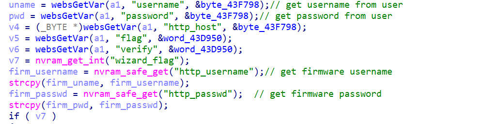
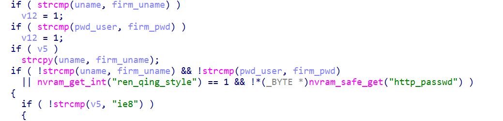
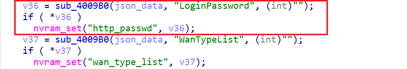
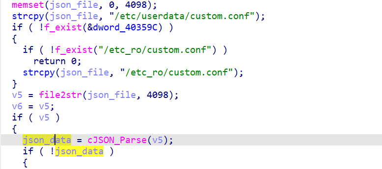
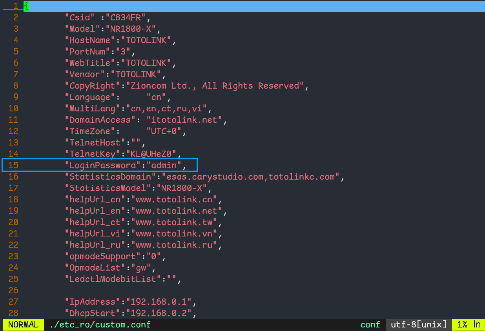

## totolink nr1800x hard-coded web management password

## irmware info

Vendor: Totolink

Firmware: Nr1800x

Version: nr1800x-v9.1.0u.6681_b20230703

Support & Download URL: https://www.totolink.net/data/upload/20230830/3f37d49f50b33c3cf8ab241570728d39.zip

## Description

totolink nr1800x contains hard-coded web management password, which allows any user to log in and execute privilege action.

## Details

In binary `www/cgi-bin/cstecgi.cgi` at address `0x433580`, the following code handles user's authentication procedure.First, it retrive username and password from user's authentication request, and get firmware username and apssword.

Then , the firmware uses `strcmp` to compare credential from firmware and user.

It can be found that, the firmware stores credential at nvram with key `http_passwd`. However, during initialization, the following code writes into nvram with key `http_passwd`. The data is read from variable `json_data` with key `LoginPassword`

backtrack what `json_data` is, we can find that it is initializaed from `custom.conf`, which can be found in firmware's file system and is hard coded with string `admin`

## Timeline

[02/12/2025] report to cve