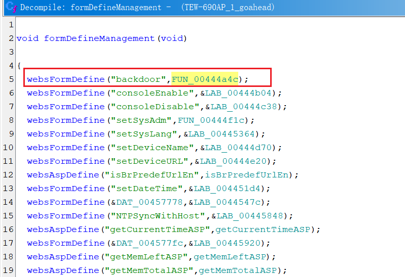
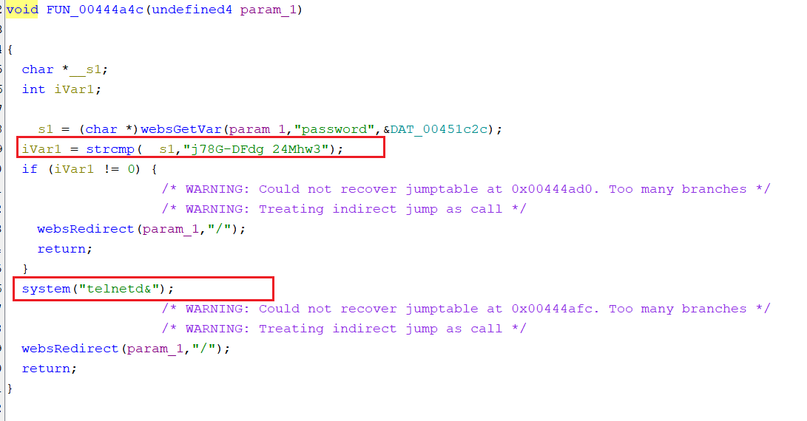

# TEW-690AP backdoor vulnerability

## Affected firmware

Undocumented TELNET service in TRENDnet TEW-690AP when a web page named backdoor contains an HTML parameter of password and a value of j78G¬DFdg_24Mhw3.

Affected Version: TEW-690AP Version v3.0R

## Details

There is an undocumented service called `backdoor` in the backend HTTP service binary `goahead`

The handler of this backdoor service compares user input with a hard-coded string j78G-DFdg_24Mhw3, and opens telnet service if it passes authentication.

This vulnerability is a recurring vulnerability of CVE-2013-3367. But this product has not been tagged with this vulnerability. So it should be assigned with another CVE id.