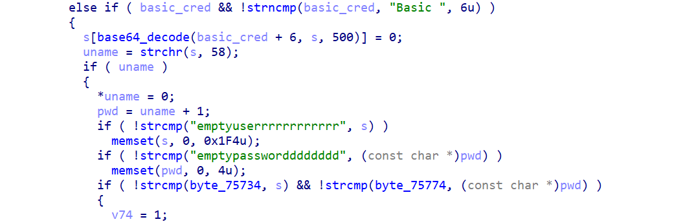

# TEW818dru hard-coded credential

## firmware information

Vendor: Trendnet

Product: AC1900(TEW-818DRU)

Version: up to firmware version 1.0.14.6

product URL: https://www.trendnet.com/support/support-detail.asp?prod=100_TEW-818DRU

firmware download website: https://www.trendnet.com/support/support-detail.asp?prod=100_TEW-818DRU

## description

Trendnet ac1900 has hard-coded credential vulnerability. Malicious attackers can log in into the web service of firmware through hard-coded credential and gain administrative privilege.

## detail

In the authentication procedure of this firmware, the

