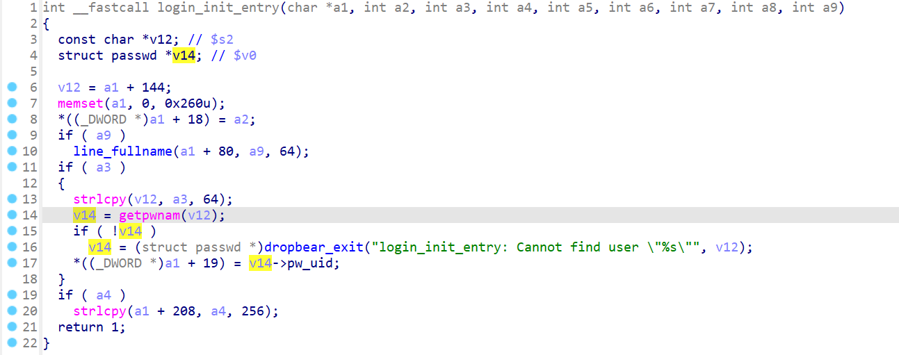

# trendnet several default credential vulnerability

In several trendnet products there exists default credential vulnerabilities which allows remote attacker to gain administrative privileges.

## Affected products

1. TI-G160i with version v1_1.0.5.S0, https://www.trendnet.com/products/product-detail?prod=115_TI-G160i

2. TI-PG102i with version v1_1.0.11, v1_1.0.13 and v1_1.0.15, https://www.trendnet.com/store/products/industrial/10-Port-Industrial-Gigabit-L2-Managed-PoEplus-DIN-Rail-Switch-24-57V-TI-PG102i

3. TPL-430AP with version 1.0.1, https://www.trendnet.com/products/powerline/wifi-everywhere-powerline-1200-av2-wireless-access-point-TPL-430AP

## Details

These products contains a Use of Weak Credential vulnerability. 

## TI-PG102i and TI-G160i series

In the /etc/passwd file, there contains the following contents

```txt
root:$1$$f83ImQzueI8CSjBqf4l921:0:0:root:/root:/bin/sh
bin:*:1:1:bin:/bin:/sbin/nologin
```

Several services uses the credential for authentication。 For example, the `dropbear`  service, which is the same as ssh services for embedded systems, uses `getpwnam` to retrive contents from `/etc/passwd` for authentication.



By decrypting the credentials, unauthenticated attackers can decrypt these file and issue unauthorized attack. 

## TPL-430AP

The etc/shadow file contains the following contents, which is used for authentication in the `dropbear` binary

```txt
root:$1$BOYmzSKq$ePjEPSpkQGeBcZjlEeLqI.:13796:0:99999:7:::
```

