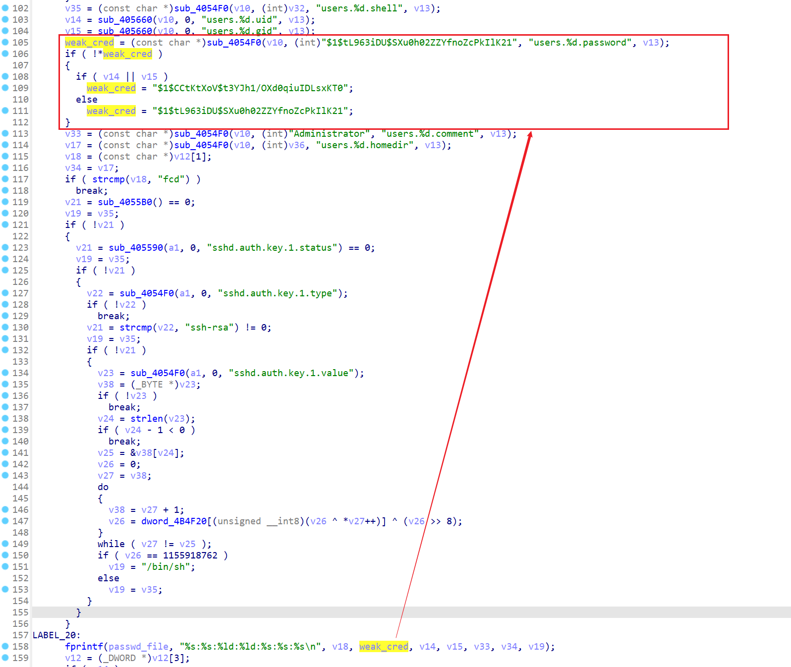

# Ubiquiti several Hard-coded credential Vulnerability-2

# Affected firmware and version

- GigaBeam,v1.4.2
  - GBE.v1.4.2.a96cd2e9.230330.1133.bin
  - URL: https://fw-download.ubnt.com/data/unifi-firmware/4c9a-UBB-1.0.7-9ff2dcefaa25471298e709680726544a.bin
- TI board,v6.3.11
  - Version: TI.v6.3.11.33396.230425.1547.bin
  - URL: https://dl.ubnt.com/firmwares/XN-fw/v6.3.11/TI.v6.3.11.33396.230425.1547.bin
- XM board,v3.6.11
  - XM.v6.3.11.33396.230425.1742.bin
  - URL: https://dl.ubnt.com/firmwares/XN-fw/v6.3.11/XM.v6.3.11.33396.230425.1742.bin
- EdgePower,v1.9.0
  - EP.v1.9.0.a67ced.210524.1407.bin
  - https://dl.ubnt.com/firmwares/edgemax/EdgePower/v1.9.0/EP.v1.9.0.a67ced.210524.1407.bin
- XC board,v8.7.0
  - XC.v8.7.11.42152.200203.1256.bin
  - https://dl.ubnt.com/firmwares/XC-fw/v8.7.11/XC.v8.7.11.46972.220614.0419.bin
- TI board,v6.3.6
  - TI.v6.3.6.33330.210818.1900.bin
  - https://dl.ubnt.com/firmwares/XN-fw/v6.3.6/TI.v6.3.6.33330.210818.1900.bin
- 2WA board,v8.7.4
  - 2WA.v8.7.4.45112.210415.1103.bin
  - https://dl.ubnt.com/firmwares/XC-fw/v8.7.4/2WA.v8.7.4.45112.210415.1103.bin
- 2XC board,v8.7.8
  - 2XC board,v8.7.8
  - https://dl.ubnt.com/firmwares/XC-fw/v8.7.8/2XC.v8.7.8.46705.220201.1820.bin

## Description

Several Ubiquiti firmware contains Use of Weak Credential vulnerability. The root credential is embedded in binary `ubntbox`. During firmware startup, the following hard-coded credential will be written into `etc/passwd`. 

In the function at address `0x40DD60`, weak credential has been written into the `etc/passwd` file of the device.

In the following code, The below line 80 opens `/etc/passwd`, then line 157 writes content into `/etc/passwd`

Upon inspecting the content of the file, we can see that the default is '$1$tL963iDU$SXu0h02ZZYfnoZcPkIlK21' with '$1$' indicating the hash algorithm, the salt 'tL963iDU' and hash 'SXu0h02ZZYfnoZcPkIlK21'. There are totally two weak credential that will be written into the `/etc/passwd`, depends on the configuration of the device.

> $1$CCtKtXoV$t3YJh1/OXd0qiuIDLsxKT0
>
> $1$tL963iDU$SXu0h02ZZYfnoZcPkIlK21

Malicious attacker can reverse engineer the firmware and decrypt and gain the credential to log into the firmware.

## Security Compliance

According to the **NIST SP 800-63B** Digital Identity Guidelines, predictable or static passwords (even if hashed) are not allowed for initial user authentication.

https://pages.nist.gov/800-63-3/sp800-63b.html

> Memorized secrets that are randomly chosen by the CSP (e.g., at enrollment) or by the verifier (e.g., when a user requests a new PIN) SHALL be at least 6 characters in length and SHALL be generated using an approved random bit generator [SP 800-90Ar1].